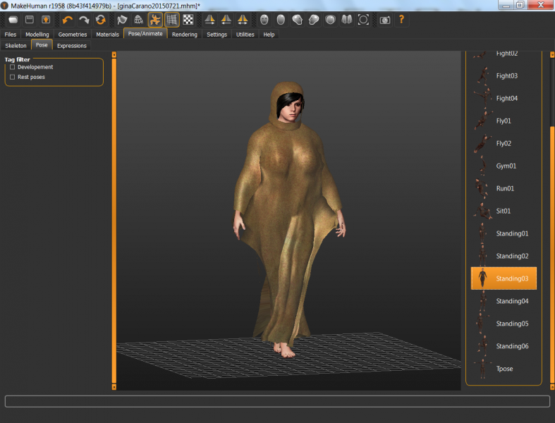

# Big Desert Poncho

* Author: brkurt
* Category: Accessory
* Compatibility: 1.1.x
* License: CC-BY

A template (only!) for a full desert poncho.  If you want details added, contact me.  Also, you will need to create vertex groups that allow the cloth to move with the arms or legs separately.  In Blender, you can do this by automatically rigging when you export from Makehuman.  Should work for any adult female. 

