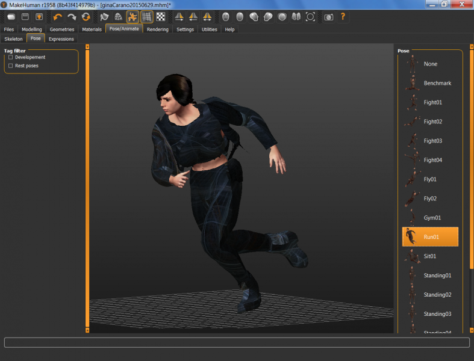

# Body Armor Shoulder Holster

* Author: brkurt
* Category: Uniform/Armor
* Compatibility: 1.1.x
* License: CC-BY

A 'casual combat' outfit for an athletic female. It wasn't made to be pretty!  The pants are tight, but the boots and jacket are heavy.  There is a bullet-proof vest with a large shoulder holster rig.  The holster was designed to hold a Lady Glock Model 17, but you can change that in the mesh.  The jacket is purposely opened on the left side so that you can pose this character in actions such as drawing and firing. The material is 'Gun Metal Blue'.  The diffuse texture map is an Apophysis fractal . I'm thinking this character would use some sort of 'chameleon' armor. 

