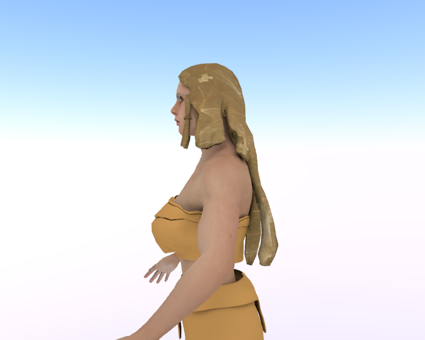

# Brunhilde (Nibelungenlied)

* Author: brkurt
* Category: Hair
* Compatibility: 1.1.x
* License: CC-BY

A sculpted hairpiece based on an old painting of Brunhilde. For you Wagnerian types. It doesn't look very good in the MH GUI, but it exports and renders just fine. It clears the body quite well, so it should move well.  Best to use on an adult female model. 
Check out the video at: https://youtu.be/FTkuwRQdxT8

