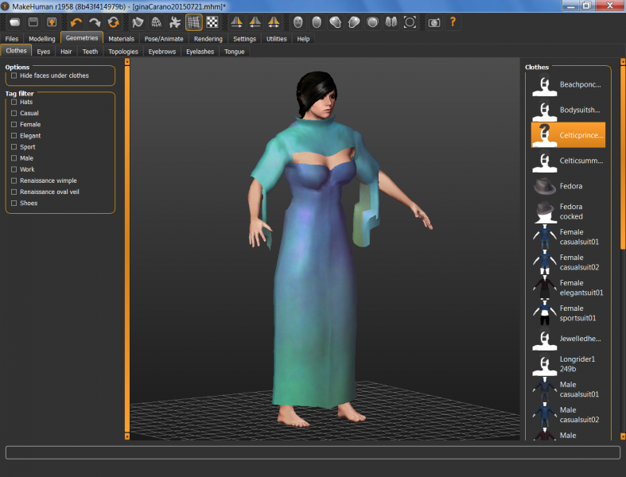

# Celtic Princess One

* Author: brkurt
* Category: Gown/Robe
* Compatibility: 1.1.x
* License: CC-BY

A formal Celtic gown, with puffed shoulders, and 'tulip' style sleeves.  I'm going to add a jewelled belt, and chains around the shoulders and elbows (and jewelled slippers)  , but I've discovered that sort of 'bling' needs to be done separately, or the mesh deformations become too severe.  This mesh should work on any female. 

