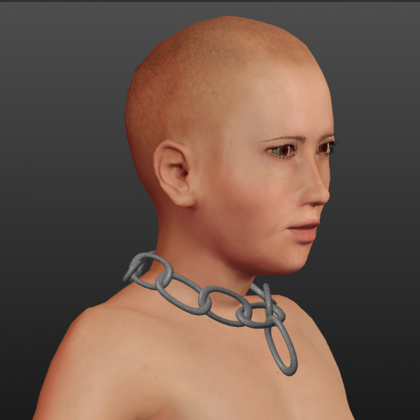

# Slave collar — Chain

* Author: learning
* Category: Accessory
* Compatibility: 1.1.x
* License: CC0

As promised, I've tried to make a chain collar for slave outfit. I've also tried to make an actual one-piece collar, but it appears as though everything around the neck of MH model gets deformed pretty bad. I have no idea as to how to fight this. It looks a bit better with chain collar, but it's still far from perfect. I've shown it on the base MH model, on actual models it only gets worse. For the texture I used a free one from http://naldzgraphics.net/textures/free-seamless-metal-textures/ It appears to be unburdened. Anyway, it will work just as well with any metal texture.

UPD 02/09/2015: I have remade the collar with special vertex group so that it won't be deformed quite so badly. It works much better now, but there still may be problems with particularly large characters or ones with really thick neck.

