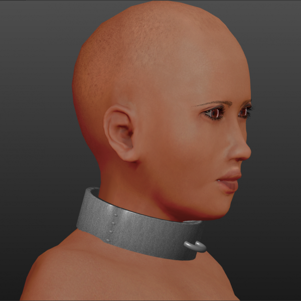

# Slave collar — full metal

* Author: learning
* Category: Accessory
* Compatibility: 1.1.x
* License: CC0

After the comment by ThimasL in http://www.makehumancommunity.org/forum/viewtopic.php?f=3&t=12101 I've learned about the way to make rigid things in MH by creating custom vertex groups. As such, I've made another attempt to make a full metal slave collar and after fiddling with vertex groups a lot that's what I came up with. It's still far from perfect, but it looks MUCH better that what would otherwise happen. I'll probably update the chain one (http://www.makehumancommunity.org/clothes/slave_collar.html ) later using this knowledge.

UPD 02/09/2015: This asset seems to behave weird when used on large characters or ones with particularly thick necks.

