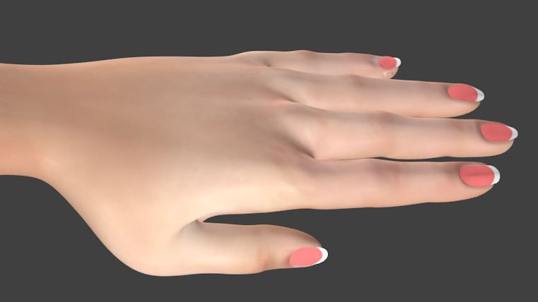

# Female Fingernails

* Author: wolgade
* Category: Unsorted/other
* Compatibility: 1.1.x
* License: CC0

Not really clothing, but additional geometry like eyebrows. Use subdivision modifier in Blender. Important: Use same subdivision level on body and fingernails. Works with base mesh, female generic, female muscle 13442 and adult female genitalia. Normal map needs improvement.

Update 22.08.2015: Material file updated. Fingernails were too shiny.

