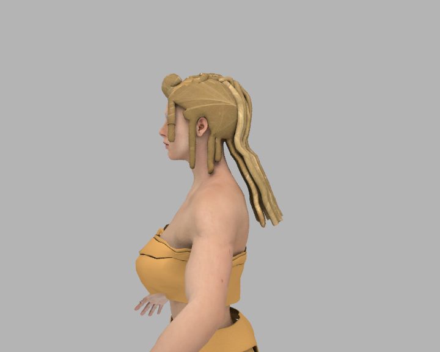

# Helen Of Troy

* Author: brkurt
* Category: Hair
* Compatibility: 1.1.x
* License: CC-BY

The braids that took a thousand hours!  This one is very experimental--it doesn't look good in the Makehuman GUI, but looks great as a Collada export.  The idea here was to accurately recreate one of the very complex hairstyles of the ancient Greek world.  The bangs are curled upward, there are scalplocks with rings, and the top of the head has eight braids, so that the hair looks very thick. Should work for any adult female. Check out the video at: https://youtu.be/FTkuwRQdxT8

