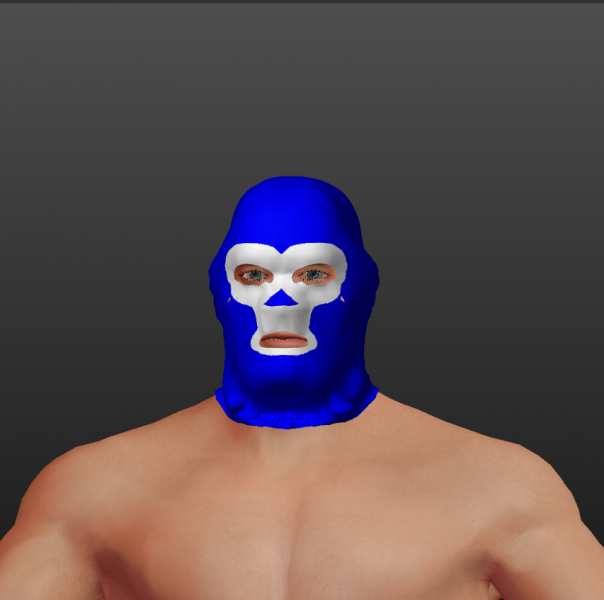

# Luchador mask

* Author: learning
* Category: Hat/Helmet
* Compatibility: 1.1.x
* License: CC0

The other day I've got a weird idea to make a full-face mask from Mexican Lucha libre for MH. This design is very simple, it's basically Joel's "Crude ski mask" http://www.makehumancommunity.org/clothes/crude_ski_mask.html with small modifications and subdivision. The texture, as before, I've made in KolourPaint, it's as simple as it gets. I've done a bit of research and found out there are hundreds of designs for masks in this sport, pretty much each wrestler has their own design and for them the mask is an important way to express their individuality and almost a sacred symbol. Of all possible designs I've chosen one of the simplest, colloquially known as "monkey face".

