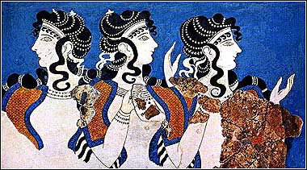

# Minoan Hairdo One

* Author: brkurt
* Category: Hair
* Compatibility: 1.1.x
* License: CC-BY

The first in a series of Minoan and Ancient Greek hair styles.  This one is inspired by a 4,000-year-old mosaic found in Crete.  The material is tinted red, as many ancient women loved to dye their hair red with henna.  This wig will work on any standard Makehuman female. 

