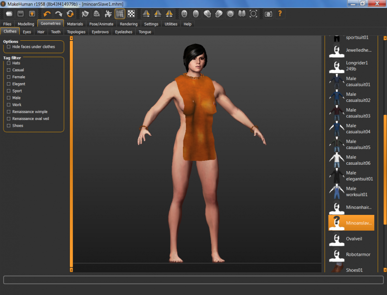

# Minoan Slave One

* Author: brkurt
* Category: Gown/Robe
* Compatibility: 1.1.x
* License: CC-BY

A very simple garment, that features 'real' chain bracelets and a chain necklace. If anyone is interested, I'll post a tutorial on it. Basically, in Blender one creates a torus with an empty modifier (to offset the next link, and to control its rotation), then  adds a Bezier circle to the torus, and sets the array to 24 items. Voila!  This model should work on any human. 

