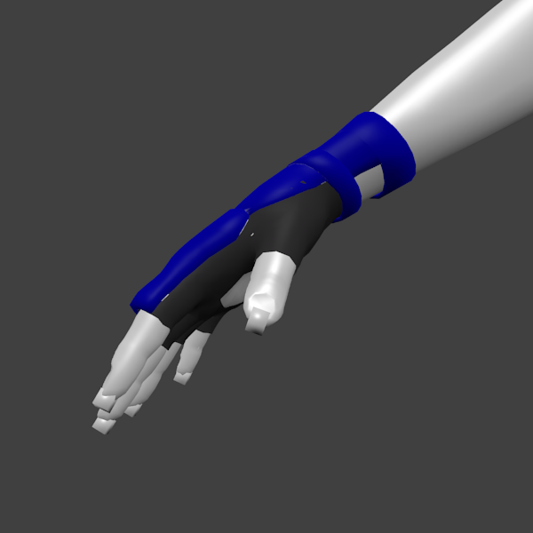

# MMA/Fighting gloves

* Author: learning
* Category: Gloves
* Compatibility: 1.1.x
* License: CC0

I've made a pair of gloves that are used in MMA and other combat sports for protecting the athlete's hands. It is also the first time I used a new and revolutionary method of creating textures by splitting the object and then texture painting each of its parts separately. The result, dare I say, doesn't look that horrible! I've also used a render from MakeClothes base human as a preview rather than an actual model, this is just because it seemed easier that way.

