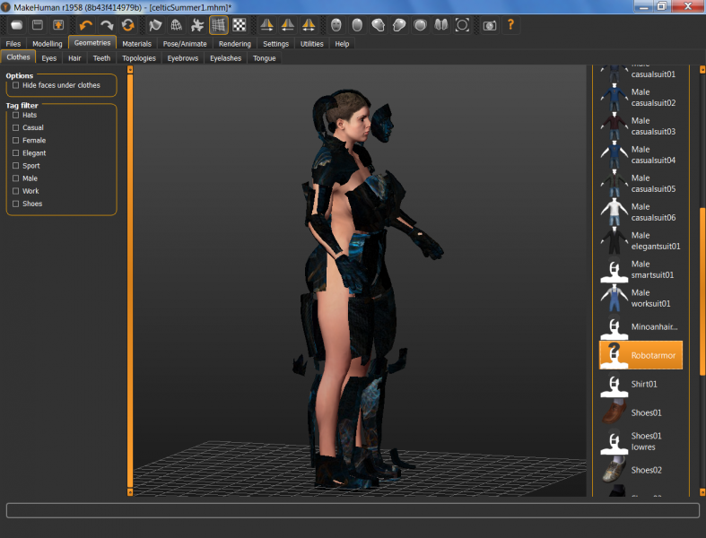

# Robot (Full) Armor

* Author: brkurt
* Category: Uniform/Armor
* Compatibility: 1.1.x
* License: CC-BY

Not a mesh for the faint of heart!  But...might as well post it. Creating Robot Armor is tricky, because of copyright infringement, so I used the base mesh, solidified it, and then pushed the separate parts out.  Completing this model will require a custom rig parented to the default (or whatever) rig.  Can be done in Blender 2.7x.  The texture map is provisional; right now it's an Apophysis fractal.  Anyway, it looks scary and cool! 

