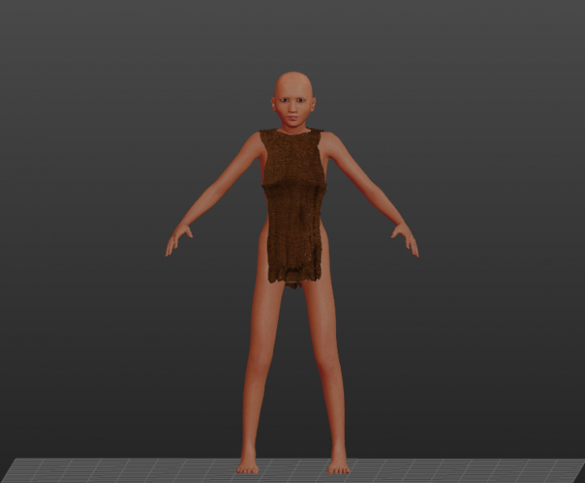

# Slave outfit

* Author: learning
* Category: Gown/Robe
* Compatibility: 1.1.x
* License: CC0

I've made a slave gown based on "Minoan Slave One" work by brkurt: http://www.makehumancommunity.org/clothes/minoan_slave_one.html I've basically taken his object and changed it over a bit, subdivided, solidified and ran cloth simulation on it. I've also made a texture (that's my first experience in texturing so don't go too hard on me). In texturing I've used some of publicly available cloth textures, but I think I've cannibalized them enough that it doesn't matter. Due to the known limitation of MakeClothes that allows only one material per clothing, the collar and bracers would need to be separate items. Maybe I'll make those too if I have time.

