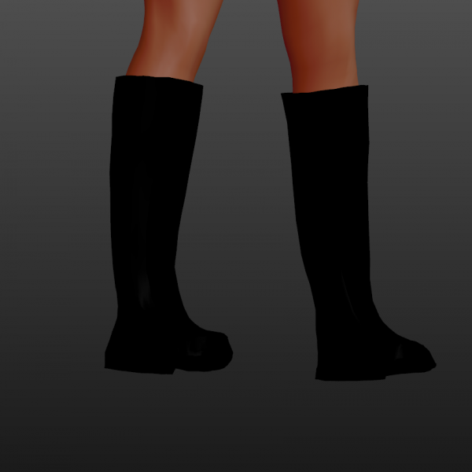

# Topboots one

* Author: learning
* Category: Shoes/Boots/Socks
* Compatibility: 1.1.x
* License: CC0

Here's an object I tried to "quadrungulate" by shrinkwrapping a square mesh onto a public domain non-quad model. It kinda works, but the fit is a bit imperfect. The mesh itself is a mess, especially at the lower part of the boot. I couldn't quite understand what's going on there.
NB: when exporting as MHX2 causes a few NaN points that prevent the model from being imported. I just opened the .mhx2 file in vim and replaced all occurrences of nan with 0 and then it worked.

So, let me know what you guys think if this is a viable way to do quad clothes, because all the other things I tried didn't work at all. This one at least "kinda" works.

